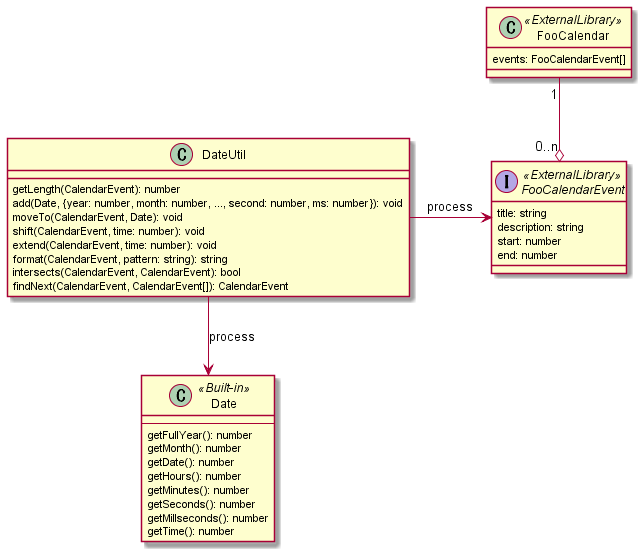

# OOP(Object-oriented programming) / オブジェクト指向プログラミング
## No util
You can grow object classes and increase chance to discover by giving functions to each object class instead of util class.

関数をUtilクラスではなく、オブジェクトであるクラスに機能を持たせることで、そのクラスが育ち、新たな発見の手助けとなるでしょう。

<table><tbody>
<tr><!-- ugly --><td valign="top">

</td><!-- beautiful --><td valign="top">

</td></tr>
</tbody></table>
