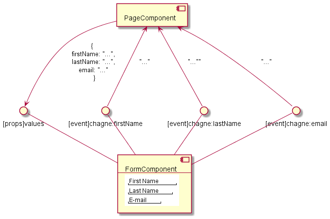
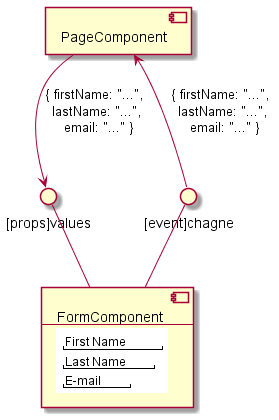
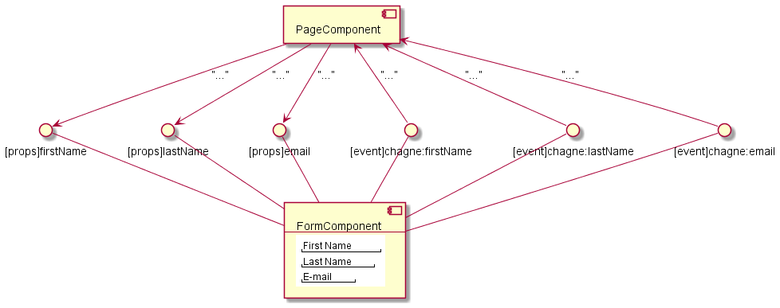

# UI component / UIコンポーネント
## Symmetrical in-out / 対称的な入出力
Component should have symmetrical in-out interface.

コンポーネントは対称的な入出力I/Fを持つべきです

<table><tbody>
<tr><!-- ugly --><td valign="top">

</td><!-- beautiful --><td valign="top">

---
or

</td></tr>
</tbody></table>
